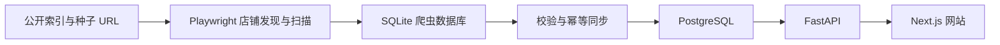

# AI Price Radar

[](LICENSE)
[](https://ai.pricememo.cn/)

面向 AI 订阅商品的开源公开报价聚合平台。项目从公开店铺发现商品，完成标准化、分类、库存与价格更新，并通过可核验来源的网页目录提供比价能力。

**在线站点：[https://ai.pricememo.cn/](https://ai.pricememo.cn/)**

> 本项目不是 OpenAI、Anthropic、Google、xAI 或任何第三方店铺的官方网站，不参与交易、收款、发货与售后。

## 功能

- 聚合 ChatGPT、Codex、OpenAI API、Claude、Gemini、Grok、X Premium 等公开商品报价
- 区分 ChatGPT Free、Plus、Go、K12 / Team、Pro 5x、Pro 20x 等标准商品
- 展示原始商品标题、分类、描述、库存、价格、交付方式、更新时间与来源链接
- 品牌、标准商品与来源平台组合筛选，支持搜索、仅看有货和最低价排序
- 标准产品使用清晰 URL 并复用统一目录工作区，报价通过真实分页瀑布流加载
- 区分交付形态，只用可直接比较报价计算主最低价，并保留全部相关商品最低价
- 按标题、描述摘要、交付形态、周期和质保生成同款指纹，默认聚合跨店铺重复条目
- 原始长描述在展开报价后按需加载，首屏只返回购买决策摘要
- LDXP、已审核 Dujiao-Next 与商家 Feed 通过同一完整快照原子切换，任一来源失败时保留上一份线上目录
- 记录报价历史，并保留人工审核、隐藏和重新分类状态
- 自动发现店铺、周期扫描、SQLite 校验、快照与 PostgreSQL 幂等同步
- 提供举报纠错和不公开暴露入口的基础管理后台
- 提供动态 Sitemap、自引用 canonical、产品结构化数据、独特产品说明与社交分享图
- 提供官方价格参考、数据质量、来源扫描健康、聚合趋势、浏览器本地关注清单与 Atom Feed
- 支持公开纠错记录、商家回应、LDXP 与通用商家 JSON Feed Connector

## 架构



| 层 | 技术 |
|---|---|
| Web | Next.js 15、React 19、Tailwind CSS 4 |
| API | FastAPI、SQLAlchemy 2、Pydantic |
| 数据库 | PostgreSQL 16 |
| 数据管道 | Python、psycopg、SQLite |
| 爬虫 | Python、Playwright Chromium |
| 部署 | Docker Compose、Caddy、systemd |

## 快速开始

推荐使用 Docker Engine 或 Docker Desktop，并确保已经安装 Compose。

```bash
git clone https://github.com/BeterXie/ai_price_radar.git
cd ai_price_radar
cp .env.example .env
docker compose -f docker-compose.yml -f docker-compose.dev.yml up --build -d
```

Windows 可以复制 `.env.example` 为 `.env` 后运行：

```text
start_windows.bat
```

默认地址：

- 网站：`http://localhost:3000`
- 管理页面：`http://localhost:3000/admin`
- API 文档：`http://localhost:8000/docs`
- 健康检查：`http://localhost:8000/health`

项目默认不会写入演示数据。如需本地演示，可在 `.env` 中临时设置 `SEED_DEMO_DATA=true`。

## 配置

至少修改以下生产环境配置：

| 变量 | 用途 |
|---|---|
| `POSTGRES_PASSWORD` | PostgreSQL 密码 |
| `ADMIN_API_KEY` | 管理 API 密钥，建议使用至少 32 字节随机值 |
| `PUBLIC_SITE_URL` | 网站公开地址 |
| `WEB_ORIGIN` | API 允许访问的 Web Origin |
| `NEXT_PUBLIC_API_BASE_URL` | 浏览器访问的 API 地址 |
| `INTERNAL_API_BASE_URL` | Next.js 容器访问 API 的内部地址 |
| `SITE_ADDRESS` | Caddy 监听的域名 |

不要提交 `.env`、数据库、浏览器 Profile、会话状态、备份或真实管理密钥。仓库仅提供安全的 `.env.example`。

## 数据采集与自动更新

生产脚本会完成“扫描 → SQLite 校验 → 快照 → PostgreSQL 幂等同步”，无需人工二次导入：

```bash
bash scripts/install_remote_timers.sh
```

默认调度：

- 商品库存扫描：每 10 分钟
- 常规候选店铺扫描：每小时
- 新店发现：每 12 小时

三类任务共享单实例文件锁；重叠任务会安全跳过。浏览器扫描默认保持请求间隔，并在连续遇到验证、阻断或限流时熔断。项目不会绕过 CAPTCHA 或 WAF；首次遇到正常验证时，需要由操作者在真实浏览器中完成。

生产更新应把 LDXP、审核通过的 Dujiao-Next 与配置的商家 Feed 一次性发布：

```bash
python pipeline/publish_catalog.py \
  --ldxp-db /data/ldxp_crawler.db \
  --dujiao-db /data/ldxp_crawler.db \
  --merchant-sources /data/merchant_sources.json \
  --database-url "$DATABASE_URL"
```

没有商家 Feed 配置时可以省略对应参数。历史 CSV 可通过 `pipeline/import_csv.py` 导入。重复导入不会产生重复报价，价格、库存或状态变化时才会写入新历史记录。

## API

主要公开接口：

```text
GET  /api/v1/products
GET  /api/v1/products/{slug}
GET  /api/v1/products/{slug}/offers?offset=0&limit=30
GET  /api/v1/products/{slug}/groups?offset=0&limit=30
GET  /api/v1/products/{slug}/groups/{fingerprint}
GET  /api/v1/offers/{id}/description
GET  /api/v1/snapshot
GET  /api/v1/shops/{token}
GET  /api/v1/meta
GET  /api/v1/corrections
GET  /api/v1/watch.atom?targets=chatgpt-plus:100
POST /api/v1/reports
POST /api/v1/shop-requests
```

管理接口位于 `/api/v1/admin/*`，通过 `X-Admin-Key` 请求头保护。请勿在客户端代码、截图、日志或公开 Issue 中粘贴管理密钥。

商家可通过 `/shops/submit` 提交链动小铺公开店铺链接或公开 HTTPS JSON Feed。接口会校验来源、去重并复用举报限流与后台审核队列；申请通过读取验证前不会进入公开报价。Connector 说明见 [docs/CONNECTORS.md](docs/CONNECTORS.md)。

## 公开报价规则

报价必须满足以下条件才会进入公开产品和店铺页面：

- 报价处于 active、approved 状态
- 店铺与标准产品均可见
- 已归入支持的 AI 产品范围
- 观察时间没有超过有效窗口

最低价仅从价格大于 0 且库存状态为 `in_stock` 的报价中计算。分类器只把标题或原始分类能够确认品牌与商品语境的内容公开，镜像站、教程、授权工具等非账号或订阅商品不会混入主流产品报价。

标准产品和交付形态是两个独立维度。号池、中转、验证服务、体验号与形态不明的报价可以作为相关信息保留，但不参与标准产品的主最低价；新报价分类置信度不足时保持待审核状态。

从旧版本升级已有 PostgreSQL 数据库时，先备份，再运行：

```bash
python scripts/migrate_catalog_v4.py --database-url "$DATABASE_URL"
```

迁移只新增快照和报价分析字段，不删除原始数据。迁移后执行一次完整 SQLite 同步或管理端重新分类，以回填交付形态、可比性和同款指纹。

v3.2.0 还需要新增公开纠错字段：

```bash
python scripts/migrate_productization_v5.py --database-url "$DATABASE_URL"
```

启用多来源原币种保存前，还需要新增报价历史币种字段：

```bash
python scripts/migrate_currency_v7.py --database-url "$DATABASE_URL"
```

该迁移可重复执行，并会从现有 Merchant JSON 原始记录中尽力回填常用法定币种。必须在切换读取 `offer_history.currency` 的 API 前完成。

## 开发与验证

```bash
make test-api
make build-web
```

也可以分别运行：

```bash
cd apps/api
python -m pytest -q

cd ../web
npm install
npm run typecheck
npm run build
```

只读容量测试脚本位于 `scripts/benchmark_readonly.py`。请仅对自己拥有或明确获准测试的服务逐级加压。

## 项目结构

```text
apps/api/          FastAPI、数据库模型、分类与管理 API
apps/web/          Next.js 公开页面与管理页面
crawler/ldxp/      店铺发现和 Playwright 扫描器
pipeline/          SQLite / CSV 到 PostgreSQL 的同步管道
deploy/            Caddy 与 systemd 配置
scripts/           部署、刷新、备份、恢复和压测脚本
docs/              架构、部署与数据政策
```

更详细的说明：

- [架构说明](docs/ARCHITECTURE.md)
- [部署指南](docs/DEPLOYMENT.md)
- [生产快速部署](docs/QUICK_DEPLOY.md)
- [数据政策](docs/DATA_POLICY.md)
- [项目交接文档](docs/HANDOVER.md)
- [验证记录](VALIDATION.md)

## 数据与安全边界

本项目仅处理公开可访问的商品信息，不应存储或发布：

- 卡密、账号密码或访问令牌
- 订单、支付和客户身份信息
- 私人聊天、邮箱或其他非公开数据

原站链接与更新时间应始终保留。风险文字只能表达来源页面中可以核验的事实，不应据此自动作出欺诈结论。部署和采集前，请自行确认目标站点服务条款、robots 政策、当地法律以及合理的访问频率。

如果发现密钥泄露或其他安全问题，请不要创建公开 Issue，应先撤销相关凭证并通过仓库所有者的私下联系方式报告。

## 参与贡献

欢迎提交 Issue 和 Pull Request。提交前请：

1. 保持改动范围清晰，不提交真实数据或凭证。
2. 为分类、导入或 API 行为变化补充测试。
3. 确保 API 测试、前端类型检查和生产构建通过。
4. 对新增采集源说明数据来源、访问频率和合规边界。

## 版本与发布

当前版本：`3.2.1`。正式发布前请完成 `docs/RELEASE_CHECKLIST.md`，发布说明见 `RELEASE_NOTES_v3.2.1.md`。

## 开源协议

代码按 [MIT License](LICENSE) 开源。第三方品牌、商标、商品数据和站点内容仍归各自权利人所有，不因本项目采用 MIT 协议而改变其权利归属。

## 免责声明

本项目及其在线实例仅用于整理公开报价与技术研究，不对第三方商品真实性、长期可用性、账号安全、交易结果或售后服务作出保证。使用者应自行核验来源并承担使用、部署和采集行为产生的责任。
